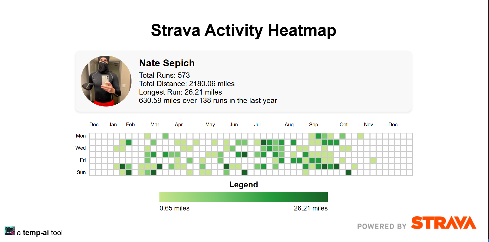

# Strava Running Activity Visualization

## Introduction
This project visualizes running activity data from Strava using an interactive heatmap. Users can authenticate with Strava to display their actual data or view example data as a fallback. Key features include profile summaries, activity heatmaps, and hover-based tooltips.

---

## Example
### Example Page

### Example Tooltip

---

## Access the Visualization
The page is live and accessible at:
https://nate-sepich.github.io/strava-gh-viz/

## Features
- OAuth Authentication: Securely connect and fetch Strava activity data.
- Interactive Heatmap: Displays running activity intensity over the last year.
- Profile Summary: Showcases total runs, mileage, and longest run.
- Responsive Design: Optimized for both desktop and mobile users.
- Example Data: Displays realistic dummy data when authorization is not provided.

## Usage
- Visit the live page: https://nate-sepich.github.io/strava-gh-viz/.
- Authorize Strava:
  - Click "Connect with Strava" to securely link your account.
- View your running activities over the past year.
- **Interpreting the Heatmap:**
  - Each square represents a day's activity.
  - Colors range from light green (low intensity) to dark green (high intensity).
  - Hover over squares to view detailed stats.
- **Example Data:**
  - If you don’t connect your Strava account, example data will be displayed.

## How It Works
### Data Collection:
Fetches data via Strava's API for the last 365 days.
### Heatmap Rendering:
Displays days of activity intensity color-coded based on distance.
### Fallback:
Uses realistic dummy data when API data isn't available or when authorization is not provided.

## API Endpoints
- Authorization: https://www.strava.com/oauth/token
- Profile Data: https://www.strava.com/api/v3/athlete
- Activity Data: https://www.strava.com/api/v3/athlete/activities

## Troubleshooting
- **No Data Displayed:** Ensure you’ve authorized the app and that your Strava account contains activities from the last year.
- **Authorization Issues:** Double-check your connection to Strava and reauthorize if necessary.
- **Missing UI Elements:** Ensure you are visiting the correct URL: https://nate-sepich.github.io/strava-gh-viz/.

## Future Enhancements
- Filters for activity types (e.g., runs, rides).
- Support for additional activity metrics like elevation gain or pace.
- Enhanced mobile experience.

## License
This project is licensed under the MIT License.